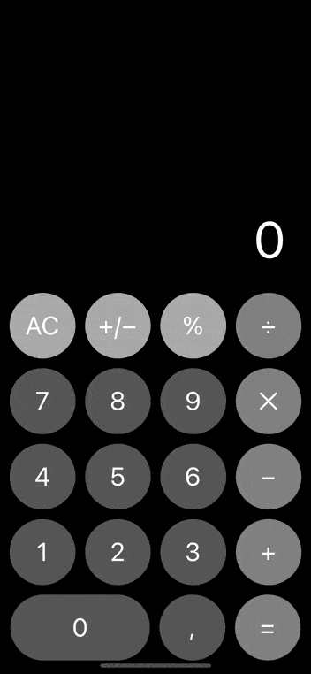
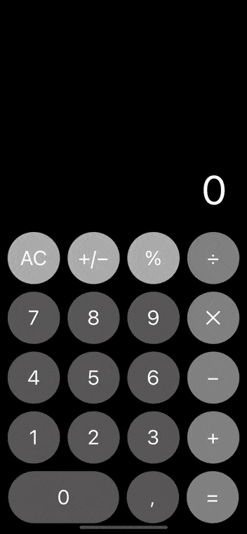

# CALCULATOR - do simple calculations easily
A basic calculator application created with **SwiftUI**.  
Simple design, easy to use.

## Table of Contents
* [Introduction](#introduction)
* [Requirements](#requirements)
* [Installation](#installation)
* [Features](#features)
* [Contacts](#contacts)

## Introduction
**Calculator** is an application which must be in all devices, because no one knows when and where it will be needed to calculate something.  
This calculator is very easy to use, it does not have any scary and complicated functions, only those that are in the usual everyday pocket calculator.  

## Requirements
* Xcode 11.2 or later
* iOS 13.2 or later

## Installation
1. Clone the repository:  
   * using HTTPS:  
`$ git clone https://github.com/milaplatonova/Calculator.git`
    * using SSH:  
`$ git clone git@github.com:milaplatonova/Calculator.git`
1. Open the project in Xcode:  
`$ open Calculator.xcodeproj`
1. Choose the **iOS Simulator**, Build and Run the project.

## Features
* simplicity and ease of use
* stylish design
* iPhone and iPad realization
* basic calculations such as:  
 :heavy_plus_sign: addition  
 :heavy_minus_sign: subtraction  
 :heavy_multiplication_x: multiplication  
 :heavy_division_sign: division
* percentage calculations
* scientific style for large numbers:  

## Contacts
Lyudmila Platonova  
:email: milaplatonova@icloud.com  
:bust_in_silhouette: [LinkedIn](linkedin.com/in/lyudmila-platonova-916097222)

